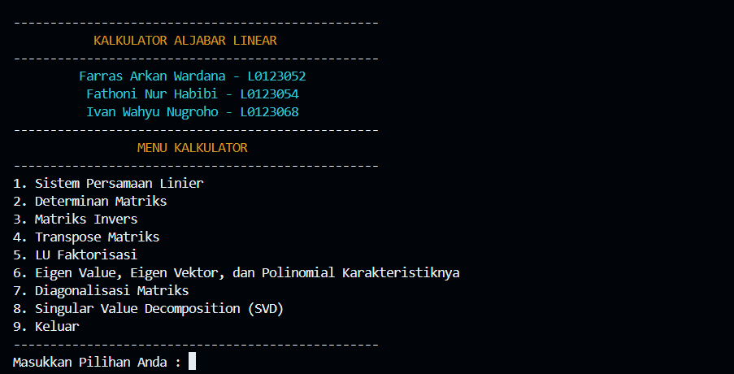
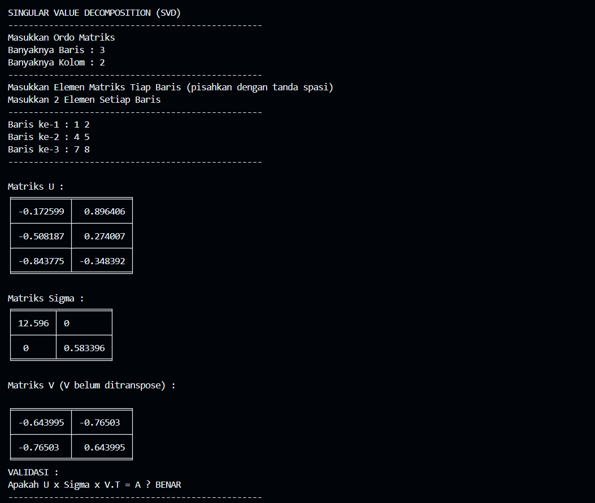

# Aplikasi Aljabar Linear pada Persamaan Linear

## Latar Belakang

Aplikasi Aljabar Linear ini adalah proyek aplikasi yang dikembangkan sebagai proyek tugas Ujian Tengah Semester mata kuliah Aljabar Linear yang diampu oleh [Prof. Drs. Bambang Harjito, M.App.Sc., Ph.D.](https://bambang.staff.uns.ac.id/). Proyek ini dikembangkan oleh :

1. Farras Arkan Wardana (L0123052)
2. Fathoni Nur Habibi (L01233054)
3. Ivan Wahyu Nugroho (L013068)

## Deskripsi Aplikasi

Aplikasi Aljabar Linear ini merupakan aplikasi kalkulator berbasis _console_ yang dapat melakukan kalkulasi pada matriks dan sistem persamaan linear.

Untuk matriks, berikut yang dapat dikalkulasi oleh program ini :

* Transpose, Determinan, Operasi Aritmatika Matriks (penjumlahan, pengurangan, dan perkalian) dan Invers matriks (metode Gaussian, metode Gauss Jordan, dan metode balikan matriks)
* Nilai eigen, vektor eigen, dan persamaan dan akar-akar dari polinomial karakteristiknya
* LU _Decompositon_
* _Singular Value Decompositon_ (SVD)
* Diagonalisasi Matriks

Sementara untuk sistem persamaan linear (SPL), program ini dapat menyelesaikan sistem persamaan linear dengan berbagai metode, yaitu metode Gaussian, metode Gauss Jordan, dan metode balikan matriks. Bahkan, program ini dapat menyelesaikan sistem persamaan linear bukan hanya untuk bilangan real, melainkan untuk bilangan kompleks sekalipun.

## Dokumentasi Singkat

Program ini menggunakan bahasa pemrograman Python dengan paradigma _Object Oriented Programming_ (OOP). File utama pada program ini adalah `main.py`.

Program ini menggunakan _module_ utama pada folder `LinAlg` yang berisi beberapa file, seperti `Menu.py`, `Matriks.py`, dan `SistemPersamaan.py`. Ketiga file tersebut berisikan kelas untuk memudahkan pengorganisasian program ini. File `__init__.py` berfungsi mengekspor komponen dalam _module_ `LinAlg` dan menghubungkan _module_ `LinAlg` ketika digunakan oleh `main.py` supaya penulisan sintaksnya lebih ringkas. Sementara file `__main__.py` berfungsi memberikan informasi singkat mengenai _module_ `LinAlg`. File `__main__.py` dapat dijalankan di _console_ dengan menggunakan perintah.

```cmd
python LinAlg
```

> Anda perlu memastikan telah berada di folder yang sama dengan `main.py`.

Program ini menggunakan _library_ [NumPy](https://numpy.org/), [Sympy](https://sympy.org/), [SciPy](https://scipy.org/) sebagai _library_ utama dalam proses perhitungan. _Library_ **tabulate** berfungsi mencetak _output_ matriks dalam bentuk tabel di _console_ sehingga tampilan visual matriksnya akan lebih mudah dipahami. Sementara _library_ **Colorama** digunakan untuk melakukan _styling_ tulisan pada _console_ sehingga menjadi berwarna-warni agar lebih menarik tampilan visualnya.

## Instalasi

Program ini dikembangkan menggunakan bahasa pemrograman Python. Untuk itu, Anda perlu memastikan interpreter Python telah ter-_install_ pada perangkat Anda untuk menjalan program ini. Apabila Anda belum meng-_install_ Python, Anda dapat mengunduh interpreter Python [di sini](https://python.org) dan meng-_install_-nya.

Diperlukan library Python seperti [NumPy](https://numpy.org/), [Sympy](https://sympy.org/), [SciPy](https://scipy.org/), Tabulate, Colorama, dan DateTime untuk menjalankan program ini. Untuk meng-_install_-nya, Anda dapat menuliskan perintah berikut di _Command Prompt_ atau _terminal_ Anda :

```python
  pip install numpy sympy tabulate scipy datetime colorama
```

Untuk menjalankan program ini, Anda dapat melakukan _running_ di IDE Python seperti [PyCharm](https://www.jetbrains.com/pycharm//), _code editor_ seperti [Visual Studio Code](https://code.visualstudio.com/), atau dapat menggunakan perintah berikut pada _Command Prompt_ atau _terminal_ Anda :

```cmd
    python main.py
```

> Anda perlu memastikan telah berada pada folder yang sama dengan file `main.py`.

## Petunjuk Folder

Dalam program ini terdapat tiga folder utama, yaitu [src](src/), [doc](doc), dan [test](test). Folder [src](src) adalah folder yang berisi _source code_ dari program Aplikasi Aljabar Linear ini. Di dalamnya, terdapat file [main.py](src/main.py) yang merupakan file program utama,  modul [LinAlg](src/LinAlg/ yang berisi modul untuk program Kalkulator Aljabar Linear ini, dan [Arsip Output](src/Arsip%20Output), yaitu folder yang digunakan untuk menyimpan  _output_ hasil perhitungan.

Di dalam folder [doc](doc), terdapat laporan dokumentasi dari program Kalkulator Aljabar Linear ini dan file [README](README) untuk petunjuk awal bagi pengguna. 

Folder [test](test) adalah folder yang berisi _output_ yang didimpan dalam file **txt** guna keperluan pengujian atau _test case_ program ini. Program ini akan diuji beberapa kasus/soal sesuai yang terdapat pada buku petunjuk proyek ini.

## Petunjuk Masukan

### Masukan untuk Menu, Submenu, dan Pilihan

Untuk memberikan masukan pada menu utama dan submenu utama pada program ini, sesuaikan dengan nomor yang tertera pada awal pilihan. Sebagai contoh, jika Anda ingin mencari _Singular Value Decompositon_ (SVD), Anda dapat memberikan masukan `8` pada menu utama. Selain memberikan masukan berupa nomor menu, pada beberapa bagian menu juga diperlukan masukan berupa huruf. Sebagai contoh, jika terdapat pilihan untuk kembali ke menu utama atau tidak, akan disertakan tanda `?` dengan petunjuk masukan berupa `(y/n)`. Jika Anda menginginkan untuk kembali ke menu utama, Anda dapat memberikan masukan `y` atau `Y`.

### Masukan untuk Matriks

Untuk memberikan masukan berupa matriks, Anda dapat memberikan masukan ordo matriksnya terlebih dahulu. Ordo matriks adalah banyaknya baris dan banyaknya kolom pada matriks. Untuk memasukkan elemen pada matriks, masukkan setiap baris matriks dengan memisahkan setiap elemen dengan tanda spasi. Sebagai contoh, jika Anda memiliki matriks $
\begin{bmatrix}
  1 & -1 \\
  0 & 1 \\
  1 & 0
\end{bmatrix}
$, ordo matriks tersebut adalah $3 \times 2$ sebab terdapat tiga baris dan dua kolom. Untuk memasukkan setiap elemennya, Anda dapat menuliskannya sebagai berikut :

```input
Masukkan Ordo Matriks
Banyak Baris  : 3
Banyak Kolom  : 2

Baris ke-1    : 1 -1
Baris ke-2    : 0 1
Baris ke-3    : 1 0
```

### Masukan untuk Sistem Persamaan Linear

Pada menu sistem persamaan linear, Anda perlu menuliskan banyaknya variabel dan banyaknya persamaan dalam sistem persamaan linear yang ingin Anda masukkan. Bentuk umum persamaan linear adalah

$\Sigma_{i = 1} ^n a_i x_i = k$, dengan $k \in \mathbb{C}$ dan $a_i \in \mathbb{C}$

$a_1x_1 + a_2x_2 + a_3x_3 + \cdots a_nx_n = k$

Berikutnya, Anda dapat memasukkan setiap koefisien $(a_i)$ dari persamaannya tanpa variabel $(x_i)$. Secara otomatis, nantinya akan dibuatkan variabel $x_1, x_2, x_3, \cdots, x_n$, dengan $n$ menyesuaikan ke banyaknya variabel yang Anda berikan. Untuk bagian masukan konstanta $(k)$, konstanta yang dimaksud berada pada ruas kanan atau dengan kata lain konstanta berada di sebelah kanan tanda sama dengan $(=)$.

Sebagai contoh, jika Anda memiliki sistem persamaan linear berikut:

$
\begin{cases}
  2x_1 + 3x_2 + x_3 &= 10 \\
  x_1 + 2x_2 - x_3 &= 8 \\
  -x_1 + x_2 -2x_3 & = -5
\end{cases}
$

Anda memiliki sistem persamaan linear tiga variabel dengan tiga persamaan. Anda dapat memberikan masukan sebagai berikut 

```input
Banyak Variabel   : 3
Banyak Persamaan  : 3

Persamaan ke-1    : 2 3 1
Konstanta ke-1    : 10

Persamaan ke-2    : 1 2 -1
Konstanta ke-2    : 8

Persamaan ke-3    : -1 1 -2
Konstanta ke-3    : -5
```

Jika Anda memiliki sistem persamaan linear dengan bilangan kompleks, Anda dapat menuliskan bentuk $a + bi$, dengan $a$ adalah komponen bilangan real, $b$ merupakan komponen bilangan imaginer, dan $i$ menyatakan bilangan imaginer $(i = \sqrt{-1})$, sebagai `a+bj`.

> Untuk menuliskan bilangan imaginer, gunakan `j`, bukan `i`.
> Jika $a$ bernilai 0, Anda dapat memberikan masukan dalam bentuk $bj$ saja, tidak harus $0+bj$.
> Jika $b$ bernilai 0, Anda dapat memberikan masukan dalam bentuk $a$ saja, tidak harus $a+0j$.

Sebagai contoh, jika Anda memiliki sistem persamaan linear dengan bilangan kompleks seperti berikut:

$
\begin{cases}
  (1+i)x_1 + (2-i)x_2 &= 3+2i \\
  -ix_1 + (1+i)x_2 &= 6-i
\end{cases}
$

Anda memiliki sistem persamaan linear dua variabel dengan dua persamaan. Anda dapat memberikan masukan berikut:

```input
Banyak Variabel   : 2
Banyak Persamaan  : 2

Persamaan ke-1    : 1+j 2-j
Konstanta ke-1    : 3+2j

Persamaan ke-2    : -j 1+j
Konstanta ke-2    : 6-j
```

## Petunjuk Keluaran

### Matriks

Keluaran untuk matriks akan ditampilkan dalam bentuk tabel matriks. Hal ini dimaksudkan untuk memudahkan dalam visualisasi. Selain itu, pada beberapa menu, akan ditampilan validasi untuk pembuktian. Hal ini digunakan untuk pembuktian _output_ telah sesuai dengan teori. 

### Sistem Persamaan Linear

Dalam sistem persamaan linear, keluaran berupa bilangan imaginer terkadang akan ditampilkan dalam bentuk `I` atau `j`. Keduanya sama saja, `i` = `j` = $\sqrt{-1}$.

### File _output_ yang disimpan

File _output_ akan disimpan dalam folder [**Arsip Output**](src/Arsip%20Output/) dengan ekstensi **.txt** sesuai dengan nama yang diberikan oleh pengguna dan diikuti dengan tanggal dan waktu untuk memastikan nama file adalah unik dan tidak terjadi duplikasi nama file.

## _Python Libraries_


[](https://sympy.org/)


## _Screenshots_

### Tampilan Menu



### Tampilan _Output_



## Proyek Ini Dikembangkan Oleh

1. [Farras Arkan Wardana (L0123052)](https://www.instagram.com/arknwrdn/)
2. [Fathoni Nur Habibi (L01233054)](https://www.instagram.com/fn._habibi/)
3. [Ivan Wahyu Nugroho (L013068)](https://instagram.com/ifwhy._)

## Institusi

<div style="display:flex; justify-content:center; border:3px solid #00AFEF; align-items:center; padding:20px; border-radius:10px; height:max-content;" >
  <a href="https://uns.ac.id" style="color:#00AFEF; text-decoration:none">
    
  </a>

  <div style="margin-left:30px; font-family:Times New Roman; font-size:1.15rem; display:flex; flex-direction:column; font-weight:bold; height:105px; color:#00AFEF">
    <p><a href="https://if.fatisda.uns.ac.id" style="color:#00AFEF; text-decoration:none">Program Studi Informatika</a></p>
    <p><a href="https://fatisda.uns.ac.id" style="color:#00AFEF; text-decoration:none">Fakultas Teknologi Informasi dan Sains Data</a></p>
    <p><a href="https://uns.ac.id" style="color:#00AFEF; text-decoration:none">Universitas Sebelas Maret</a></p>
  </div>  
</div>
